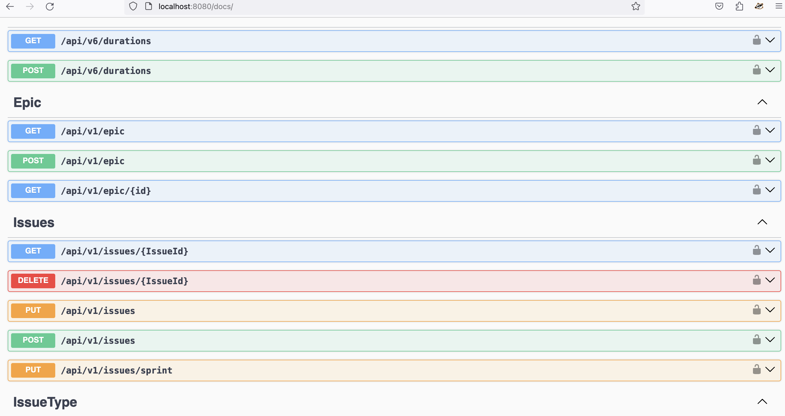
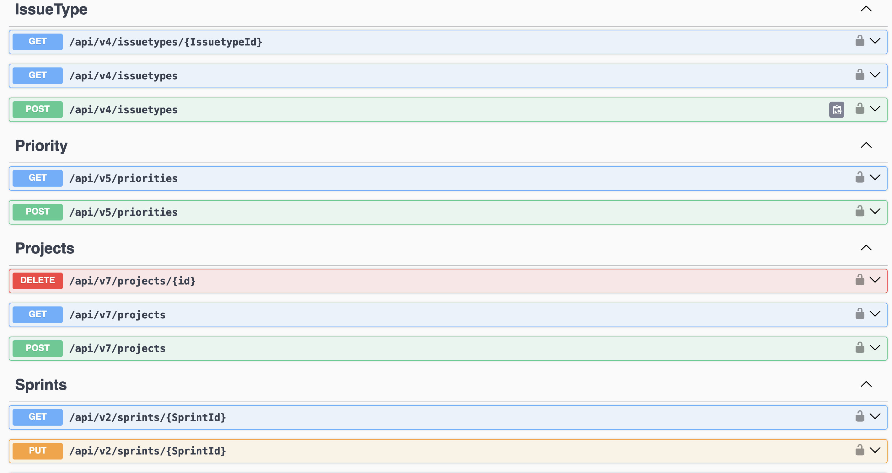
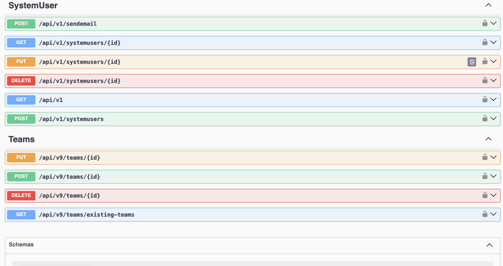

# Backlog

 session cookies—cookies that do not explicitly set an expiration date with Max-Age or Expires—as these are instead cleared when the browsing session ends.

 __Secure- prefix: Cookies with names starting with __Secure- (dash is part of the prefix) must be set with the secure flag from a secure page (HTTPS).

__Host- prefix: Cookies with names starting with __Host- must be set with the secure flag, must be from a secure page (HTTPS), must not have a domain specified (and therefore, are not sent to subdomains), and the path must be /


```scala
 expires = None,
maxAge = None,
```
the csrf cookie is a session cookie as both the expires and maxAge are None. firefox indicates it as Session

`git fetch origin` fetches all remote branches

`git checkout -b routes origin/routes` is used to create a local branch based of the remote branch
branch 'routes' set up to track 'origin/routes'.
Switched to a new branch 'routes'


routing tables map specific routes to corresponding request handlers
This also involves manual decoding of headers, query parameters and request bodies
It also involves manual encoding of responses

```scala
// Define a type lambda that represents a function type with a higher-kinded type parameter
type MyLambda = ({ type Y[X] = Option[X] })#Y
// MyLambda is equivalent to Option[_]

val value: MyLambda[Int] = Some(42) // equivalent to Option[Int]

```






When a cookie is set with the domain `.localhost`, it indicates that the cookie should be sent to any subdomain of `localhost`, including `chat.localhost`

When a cookie is set for `api.example.com`, it is only accessible to requests made to `api.example.com` or its subdomains (e.g., sub.api.example.com). It will not be sent to requests made to `example.com` or any other domain.

If you want a cookie to be accessible by both `example.com` and `api.example.com`, you need to set the cookie with a domain attribute of `.example.com`. This leading dot indicates that the cookie is accessible to all subdomains of `example.com`
the Domain attribute specifies which domain and its subdomains can access the cookie. If you set the Domain attribute to .example.com, the cookie will be accessible to example
cookie, interceptors,


prometheus -> graphana


