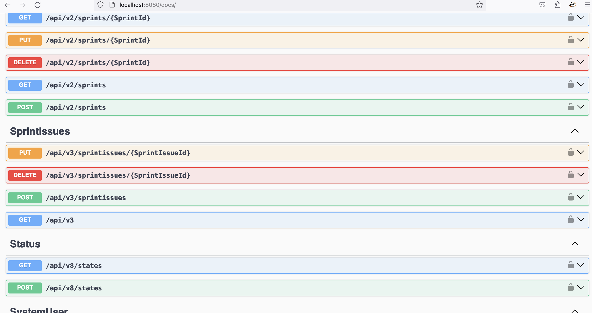

# Backlog

 session cookies—cookies that do not explicitly set an expiration date with Max-Age or Expires—as these are instead cleared when the browsing session ends.

 __Secure- prefix: Cookies with names starting with __Secure- (dash is part of the prefix) must be set with the secure flag from a secure page (HTTPS).

__Host- prefix: Cookies with names starting with __Host- must be set with the secure flag, must be from a secure page (HTTPS), must not have a domain specified (and therefore, are not sent to subdomains), and the path must be /


```scala
 expires = None,
maxAge = None,
```
the csrf cookie is a session cookie as both the expires and maxAge are None. firefox indicates it as Session

`git fetch origin` fetches all remote branches

`git checkout -b routes origin/routes` is used to create a local branch based of the remote branch
branch 'routes' set up to track 'origin/routes'.
Switched to a new branch 'routes'


routing tables map specific routes to corresponding request handlers
This also involves manual decoding of headers, query parameters and request bodies
It also involves manual encoding of responses

```scala
// Define a type lambda that represents a function type with a higher-kinded type parameter
type MyLambda = ({ type Y[X] = Option[X] })#Y
// MyLambda is equivalent to Option[_]

val value: MyLambda[Int] = Some(42) // equivalent to Option[Int]

```





When a cookie is set with the domain `.localhost`, it indicates that the cookie should be sent to any subdomain of `localhost`, including `chat.localhost`

When a cookie is set for `api.example.com`, it is only accessible to requests made to `api.example.com` or its subdomains (e.g., sub.api.example.com). It will not be sent to requests made to `example.com` or any other domain.

If you want a cookie to be accessible by both `example.com` and `api.example.com`, you need to set the cookie with a domain attribute of `.example.com`. This leading dot indicates that the cookie is accessible to all subdomains of `example.com`
the Domain attribute specifies which domain and its subdomains can access the cookie. If you set the Domain attribute to .example.com, the cookie will be accessible to example
cookie, interceptors,


prometheus -> graphana


every step in github actions must define a uses or run key

OTel is used for instrumenting, generating, collecting, and exporting telemetry data such as traces, metrics, and logs.for instrumenting, generating, collecting, and exporting telemetry data such as traces, metrics, and logs.
 OpenTelemetry is focused on the generation, collection, management, and export of telemetry. the storage and visualization of telemetry is intentionally left to other tools.
 To make a system observable, it must be instrumented. That is, the code must emit traces, metrics, or logs. The instrumented data must then be sent to an observability backend
Using OpenTelemetry, you can instrument your code in two primary ways:

- Code-based solutions via official APIs and SDKs for most languages
- Zero-code solutions


OTEL SDK----->OTLP Exporter---> Jaeger
                           ---> Otel Collector
        -----> Zipkin Explorer---> Zipkin
        -----> Prometheus Exporter ---> Prometheus


Error handling in tapir is divided into three areas:

    - Error outputs: defined per-endpoint, used for errors handled by the business logic

    - Failed effects: exceptions which are not handled by the server logic (corresponds to 5xx responses)

    - Decode failures: format errors, when the input values can’t be decoded (corresponds to 4xx responses, or trying another endpoint)


While 1. is specific to an endpoint, handlers for 2. and 3. are typically the same for multiple endpoints, and are specified as part of the server’s interpreter options.


`import sttp.tapir.json.circe._`


The above import brings into scope the `jsonBody[T]` body input/output description, which creates a codec, given an in-scope circe Encoder/Decoder and a Schema

`import io.circe.Printer`


```scala
object MyTapirJsonCirce extends TapirJsonCirce {
  override def jsonPrinter: Printer = Printer.spaces2.copy(dropNullValues = true)
}```

When the client rovides an unsupported paramter or repeats the same paramter multiple times in its requesrs, in both cases the client request is not as expected and should be refused... 400 Bad request


```bash
tar cf targets.tar target project/target
```

tar: The command-line utility for manipulating tar archives.
cf: Options to the tar command:
c: Create a new archive.
f: Specify the filename of the archive.
targets.tar: The filename of the archive that will be created.
target project/target: The directories to be included in the archive. In this case, it includes both the target directory and the project/target directory


~/Library/Caches/Coursier/v1/github.com/	virtuslab/scala-cli


A term closely related to unit tests is code coverage. Code coverage is a metric that gives you an overview of how much of the program is covered with tests

Cached when sbt files are found (any of *.sbt, project/**.scala, project/**.sbt, project/build.properties).

[Code Coverage](https://diamantidis.github.io/2020/05/17/ci-with-github-actions-for-scala-project)


bloop test backlog-test -w


. is the current folder
.. is the folder above the current folder
` git worktree add path/to/folder/<existing-branch-name>`
`git worktree add ../examplefolder/dev`  add for an existing branch usimg the same name as the working directory
`git worktree add ../65/release/r-8`
`git worktree add


how to use git worktree to add to create a new branch using the same name as the working directory

`git worktree add -b <new-branch-name> path/to/folder/<new-branch-name>`

you can also choose to base a new branch from another branch, tag or commit, by specifying your choice at the end of the command

` git worktree add -b <new-branch-name> path/to/folder/<new-branch-name> <existing-branch-to-use-as-base>`

`git worktree remove path/to/folder`

`git worktree prune` to ensure the .git directory is clean after removing a worktree

git worktrees share the same git history(contents of the .git directory) instead of cloning the repository in a different directory, which makes them faster and utilize less space

if you are checkout in a branch, you cn
building in the code that allows you to gather diagnostic information is called instrumenting your code

instrumenting your code gives you a way to find out what was happening inside the code  when the issue occured

tracing is capturing and correlating the execution path of a request

benefits
- Monitoring: gain insights into health and performance of the system
- Logging: valuable for troubleshooting, auditing and detecting anomalies
- Tracing: reconstruct the end-to-end flow of a specific transaction. Helps in understanding performance bottlenecks and diagnosing issues that span multiple services

Metrics — abstract signals sent from service, resource, etc.
Spans — data about single logical unit execution. For instance: timings about service method execution.
Trace — data about single logical transaction execution. For instance: handling HTTP requests.

OpenTelemetry is a set of APIs, SDKs, tooling and integrations that are designed for the creation and management of telemetry data such as traces, metrics, and logs

OpenTelemetry is designed in a way that instrumentation is abstracted over a backend it exposes metrics to. Such an approach allows supporting a variety of exporters, both pull and push based.
examples: Prometheus, Zipkin and OTPL.


#### APM Example: Datadog
Within complex APM solutions, like Datadog, it is possible to combine and monitor both metrics and spans in a single place. OpenTelemetry offers its own protocol called OTLP, which main advantage is it supports simultaneously export for metrics, spans, and logs (not covered here). OTLP is a push-based protocol, meaning the application must send data to a collector.

traces for user requests and spans for service requests

Open Telemetry Protocol — this is a gRPC, push-based protocol. Own protocol is a one of the OTELs pillars that allow it to be vendor-neutral. This protocol covers all transportation of all sorts telemetry data that OTEL handles: baggage, metrics, traces and logs.

`OpenTelemetry collector works with OTLP protocol` and can be configured to export telemetry data to various backends. A collector usually consists of the following components:
- Receivers — describe how to receive telemetry data (e.g. extract);
- Processors — describe how to process telemetry data (e.g. transform);
- Exporters — describe how to export telemetry data (e.g. load).;
- Connectors — describe how to connect telemetry data pipelines.
- Extensions — describe how to extend the collector with additional capabilities.

So to decouple the application from the monitoring infrastructure, this collector needs to do is to receive telemetry data from the application and send metrics to the Prometheus and traces to Jaeger. In terms of components, it means that the collector needs to have OTLP receiver and exporters for Prometheus and Jaeger.

```yml
receivers:
  otlp:
    protocols:
      http:
        endpoint: 0.0.0.0:4418

exporters:
  otlphttp:
    endpoint: http://jaeger:4318

  prometheus:
    endpoint: 0.0.0.0:9094
    namespace: products_service

service:
  pipelines:
    traces:
      receivers: [otlp]
      exporters: [otlphttp]
    metrics:
      receivers: [otlp]
      exporters: [prometheus]

```

which later can be supplied to the collector as a configuration file for instance in a Docker compose:

```yml
otel-collector:
  image: otel/opentelemetry-collector-contrib:0.93.0
  hostname: otel-collector
  volumes:
    - ./mount/otel-collector-config-prometheus-jaeger.yaml:/etc/otelcol-contrib/config.yaml
  ports:
    - "9094:9094" # Prometheus http exporter
    - "4418:4418" # OTLP http receiver

```

After this, we need to update the application configuration to send telemetry data to the collector:

```yml
OTEL_SERVICE_NAME=products_service
OTEL_METRICS_EXPORTER=otlp
OTEL_TRACES_EXPORTER=otlp
OTEL_EXPORTER_OTLP_ENDPOINT=http://otel-collector:4418
```


##### Collector
Vendor-agnostic way to receive, process and export telemetry data.


The OpenTelemetry Collector offers a vendor-agnostic implementation of how to receive, process and export telemetry data. It removes the need to run, operate, and maintain multiple agents/collectors. This works with improved scalability and supports open source observability data formats (e.g. Jaeger, Prometheus, Fluent Bit, etc.) sending to one or more open source or commercial backends

###### Architecture
The OpenTelemetry Collector is an executable file that can receive telemetry, process it, and export it to multiple targets, such as observability backends.

The Collector supports several popular open source protocols for receiving and sending telemetry data, and it offers an extensible architecture for adding more protocols.

Data receiving, processing, and exporting are done using pipelines. You can configure the Collector to have one or more pipelines.

Each pipeline includes the following:

- A set of receivers that collect the data.
- A series of optional processors that get the data from receivers and process it.
- A set of exporters which get the data from processors and send it outside the Collector.
The same receiver can be included in multiple pipelines and multiple pipelines can include the same exporter.

`A pipeline defines a path that data follows in the Collector: from reception, to processing (or modification), and finally to export.`

Pipelines can operate on three telemetry data types: traces, metrics, and logs.

```yml
receivers:
  otlp:
    protocols:
      http:
        endpoint: 0.0.0.0:4418

processors:
  # Filter HTTP spans to server for `GET /health` requests because of spam.
  filter/exclude-health-api-traces:
    error_mode: ignore
    traces:
      span:
        - 'attributes["http.route"] == "/health"'

  # Filter logs for `GET /health` requests logs because of spam.
  filter/exclude-health-api-logs:
    logs:
      exclude:
        match_type: regexp
        bodies:
          - '.*Health check API invoked!.*'

  # Add environment attribute to all telemetry signals.
  attributes/add-environment:
    actions:
      - key: environment
        value: development
        action: insert

exporters:
  otlphttp/jaeger:
    endpoint: http://jaeger:4318

  otlphttp/grafana-agent:
    endpoint: http://grafana-agent:4318

  prometheus:
    endpoint: 0.0.0.0:9094
    namespace: products_service

service:
  pipelines:
    traces:
      receivers:
        - otlp
      processors:
        - filter/exclude-health-api-traces
        - attributes/add-environment
      exporters:
        - otlphttp/jaeger
        - otlphttp/grafana-agent
    metrics:
      receivers:
        - otlp
      processors:
        - attributes/add-environment
      exporters:
        - prometheus
        - otlphttp/grafana-agent
    logs:
      receivers:
        - otlp
      processors:
        - filter/exclude-health-api-logs
        - attributes/add-environment
      exporters:
        - otlphttp/grafana-agent

```

Pipelines can have one or more receivers. Data from all receivers is pushed to the first processor, which processes the data and then pushes it to the next processor. A processor might also drop the data if it’s sampling or filtering. This continues until the last processor in the pipeline pushes the data to the exporters. Each exporter gets a copy of each data element. The last processor uses a fanoutconsumer to send the data to multiple exporters.

```yml
service:
  pipelines: # section that can contain multiple subsections, one per pipeline
    traces: # type of the pipeline
      receivers: [otlp, zipkin]
      processors: [memory_limiter, batch]
      exporters: [otlp, zipkin]
```


##### Receivers
Receivers typically listen on a network port and receive telemetry data. They can also actively obtain data, like scrapers. Usually one receiver is configured to send received data to one pipeline. However, it is also possible to configure the same receiver to send the same received data to multiple pipelines. This can be done by listing the same receiver in the receivers key of several pipelines:

```yml
receivers:
  otlp:
    protocols:
      grpc:
        endpoint: localhost:4317

service:
  pipelines:
    traces: # a pipeline of “traces” type
      receivers: [otlp]
      processors: [memory_limiter, batch]
      exporters: [otlp]
    traces/2: # another pipeline of “traces” type
      receivers: [otlp]
      processors: [transform]
      exporters: [otlp]

```
This config will be loaded by the Collector


#### Exporters
Exporters typically forward the data they get to a destination on a network, but they can also send the data elsewhere. For example, debug exporter writes the telemetry data to the logging destination.
The configuration allows for multiple exporters of the same type, even in the same pipeline. For example, you can have two otlp exporters defined, each one sending to a different OTLP endpoint

```yml
exporters:
  otlp/1:
    endpoint: example.com:4317
  otlp/2:
    endpoint: localhost:14317
```
you can run OpenTelemetry Collector as an agent. The agent runs as a daemon in the VM/container and can be deployed independent of the library. Once the agent is deployed and running, it should be able to retrieve traces, metrics, and logs from the library, and export them to other backends


##### Tracer Provider
A Tracer Provider (sometimes called TracerProvider) is a factory for Tracers. In most applications, a Tracer Provider is initialized once and its lifecycle matches the application’s lifecycle. Tracer Provider initialization also includes Resource and Exporter initialization. It is typically the first step in tracing with OpenTelemetry. In some language SDKs, a global Tracer Provider is already initialized for you.

##### Tracer
A Tracer creates spans containing more information about what is happening for a given operation, such as a request in a service. Tracers are created from Tracer Providers.

##### Trace Exporters
Trace Exporters send traces to a consumer. This consumer can be standard output for debugging and development-time, the OpenTelemetry Collector, or any open source or vendor backend of your choice

##### Context Propagation
Context Propagation is the core concept that enables Distributed Tracing. With Context Propagation, Spans can be correlated with each other and assembled into a trace, regardless of where Spans are generated

##### Spans
A span represents a unit of work or operation. Spans are the building blocks of Traces. In OpenTelemetry, they include the following information:

- Name
- Parent span ID (empty for root spans)
- Start and End Timestamps
- Span Context
- Attributes
- Span Events
- Span Links
- Span Status

```json
{
  "name": "/v1/sys/health",
  "context": {
    "trace_id": "7bba9f33312b3dbb8b2c2c62bb7abe2d",
    "span_id": "086e83747d0e381e"
  },
  "parent_id": "",
  "start_time": "2021-10-22 16:04:01.209458162 +0000 UTC",
  "end_time": "2021-10-22 16:04:01.209514132 +0000 UTC",
  "status_code": "STATUS_CODE_OK",
  "status_message": "",
  "attributes": {
    "net.transport": "IP.TCP",
    "net.peer.ip": "172.17.0.1",
    "net.peer.port": "51820",
    "net.host.ip": "10.177.2.152",
    "net.host.port": "26040",
    "http.method": "GET",
    "http.target": "/v1/sys/health",
    "http.server_name": "mortar-gateway",
    "http.route": "/v1/sys/health",
    "http.user_agent": "Consul Health Check",
    "http.scheme": "http",
    "http.host": "10.177.2.152:26040",
    "http.flavor": "1.1"
  },
  "events": [
    {
      "name": "",
      "message": "OK",
      "timestamp": "2021-10-22 16:04:01.209512872 +0000 UTC"
    }
  ]
}


```


###### Span Context
Span context is an immutable object on every span that contains the following:

- The Trace ID representing the trace that the span is a part of
- The span’s Span ID
- Trace Flags, a binary encoding containing information about the trace
- Trace State, a list of key-value pairs that can carry vendor-specific trace information
Span context is the part of a span that is serialized and propagated alongside Distributed Context and Baggage.

Because Span Context contains the Trace ID, it is used when creating Span Links


#### Span Kind


 - With an OpenTelemetry SDK that export telemetry signals (traces, metrics, logs) directly into a backend:
 
 - The agent collector deployment pattern consists of applications — instrumented with an OpenTelemetry SDK using OpenTelemetry protocol (OTLP) — or other collectors (using the OTLP exporter) that send telemetry signals to a collector instance running with the application or on the same host as the application (such as a sidecar or a daemonset).
 Each client-side SDK or downstream collector is configured with a collector location:
 
 In the app, the SDK is configured to send OTLP data to a collector.
1. The collector is configured to send 
2. telemetry data to one or more backends.

Zipkin Exporter depends on sdk and zipkin reporter
Prometheus exporter-> depends on sdk-metrics and prometheus as runtime dependency
Jaeger Exporter-> depends on sdk
Otlp Exporter depends on sdk-metrics, sdk-logs and sdk-trace and otlp-common as a runtime dependency
Opentelemetry-sdk depends on api,sdk-trace,sdk-metrics,sdk-common,sdk-logs


OpenTelemtry-sdk-logs depends on api amd sdk-common

OpenTelemtry-sdk-metrics,OpenTelemtry-sdk-tracing depend on api and sdk-common
OpenTelemtry-sdk-common depends on api

opentelemetry-exporter-otlp to send telemetry data to OTEL collector.


`otel4s-sdk-exporter-common` depends on `scalapb-json-scalapb-circe_3`, `http4s-ember-client`, `http4s-circe`, `otel4s-sdk-common` and `otel4s-sdk-exporter-proto_3`


`otel4s-sdk-exporter-proto_3` depends on `scalapb` and scala3


`otel4s-sdk-common` depends on scala3,`otel4s-core-common`, `otel4s-semconv`
[otel4s](https://ivan-kurchenko.medium.com/telemetry-with-scala-part-3-otel4s-c5c150303164)
[opentelemetry](https://ivan-kurchenko.medium.com/building-decoupled-monitoring-with-opentelemetry-5d2755e15922)
[Kamon](https://ivan-kurchenko.medium.com/telemetry-with-scala-part-2-kamon-5295dd9e3a1)
[opentelemetry](https://ivan-kurchenko.medium.com/telemetry-with-scala-part-1-opentelemetry-758c72a136e7)

### IOLocal
[[IOLocal]] provides a handy way of manipulating a context on different scopes

Operations on [[IOLocal]] are visible to the fiber

```bash
  ┌────────────┐               ┌────────────┐               ┌────────────┐
  │  Fiber A   │ update(_ + 1) │  Fiber A   │ update(_ + 1) │  Fiber A   │
  │ (local 42) │──────────────►│ (local 43) │──────────────►│ (local 44) │
  └────────────┘               └────────────┘               └────────────┘
 ```

 A forked fiber operates on a copy of the parent [[IOLocal]]

  A '''forked''' fiber (i.e. via `Spawn[F].start`) operates on a '''copy''' of the parent
  `IOLocal`. Hence, the children operations are not reflected on the parent context

  ```bash
                        ┌────────────┐               ┌────────────┐
                   fork │  Fiber B   │ update(_ - 1) │  Fiber B   │
                 ┌─────►│ (local 42) │──────────────►│ (local 41) │
                 │      └────────────┘               └────────────┘
  ┌────────────┐─┘                                   ┌────────────┐
  │  Fiber A   │                                     │  Fiber A   │
  │ (local 42) │────────────────────────────────────►│ (local 42) │
  └────────────┘─┐                                   └────────────┘
                 │      ┌────────────┐               ┌────────────┐
                 │ fork │  Fiber C   │ update(_ + 1) │  Fiber C   │
                 └─────►│ (local 42) │──────────────►│ (local 43) │
                        └────────────┘               └────────────┘
 ```

 Parent operations on [[IOLocal]] are invisible to children

 ```bash

                        ┌────────────┐               ┌────────────┐
                   fork │  Fiber B   │ update(_ + 1) │  Fiber B   │
                 ┌─────►│ (local 42) │──────────────►│ (local 43) │
                 │      └────────────┘               └────────────┘
  ┌────────────┐─┘                                   ┌────────────┐
  │  Fiber A   │        update(_ - 1)                │  Fiber A   │
  │ (local 42) │────────────────────────────────────►│ (local 41) │
  └────────────┘─┐                                   └────────────┘
                 │      ┌────────────┐               ┌────────────┐
                 │ fork │  Fiber C   │ update(_ + 2) │  Fiber C   │
                 └─────►│ (local 42) │──────────────►│ (local 44) │
                        └────────────┘               └────────────┘

 ```


###### Example: TraceId propagation
The IOLocal can be used for the propagation of a TraceId:

 ```scala
import cats.Monad
import cats.effect.{IO, IOLocal, Sync, Resource}
import cats.effect.std.{Console, Random}
import cats.syntax.flatMap._
import cats.syntax.functor._

case class TraceId(value: String)

object TraceId {
  def gen[F[_]: Sync]: F[TraceId] =
    Random.scalaUtilRandom[F].flatMap(_.nextString(8)).map(TraceId(_))
}

trait TraceIdScope[F[_]] {
  def get: F[TraceId]
  def scope(traceId: TraceId): Resource[F, Unit]
}

object TraceIdScope {
  
  def apply[F[_]](implicit ev: TraceIdScope[F]): TraceIdScope[F] = ev
  
  def fromIOLocal: IO[TraceIdScope[IO]] =
    for {
      local <- IOLocal(TraceId("global"))
    } yield new TraceIdScope[IO] {
      def get: IO[TraceId] =
        local.get

      def scope(traceId: TraceId): Resource[IO, Unit] =
        Resource.make(local.getAndSet(traceId))(previous => local.set(previous)).void
    }
    
}

def service[F[_]: Sync: Console: TraceIdScope]: F[String] =
  for {
    traceId <- TraceId.gen[F]
    result <- TraceIdScope[F].scope(traceId).use(_ => callRemote[F])
  } yield result
  
def callRemote[F[_]: Monad: Console: TraceIdScope]: F[String] =
  for {
    traceId <- TraceIdScope[F].get
    _ <- Console[F].println(s"Processing request. TraceId: ${traceId}")
  } yield "some response"
  
TraceIdScope.fromIOLocal.flatMap { implicit traceIdScope: TraceIdScope[IO] =>
  service[IO]
}


 ```


 ###### Project Idea

 project that includes setting up an Akka cluster on a set of three Raspberry Pis.